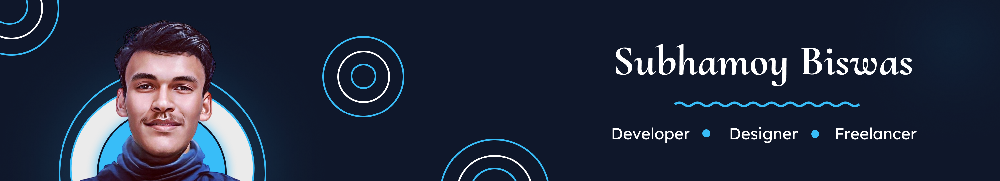

## About Me

Hello, There! 👋

I'm **Subhamoy Biswas**, a professional **Full-Stack Web**, **Cross-Platform Developer**, **UI/UX Designer**, and **Freelancer** based in **Kolkata, India**. Specialized in building scalable web, cross-platform apps and modern user interfaces! delivering industry leading solutions for over **8+** years!

`- "Building Experiances, Not just Apps!"`

- 🚀 Currently scaling [NeoDLP](https://github.com/neosubhamoy/neodlp) to Millions! (Goal reached ~10% - 100K+)
- 🌱 Learning Advance Rust, Three.js and Motion Microinteractions.
- 🥰 Always vibing to music and fueled by coffee!

> [!TIP]
> **🤙 Thinking about building something together? Always feel free to contact me! Would love to connect (Currently only working with small to mid size businessess)**

## My Favourite Technologies

## My GitHub Stats

